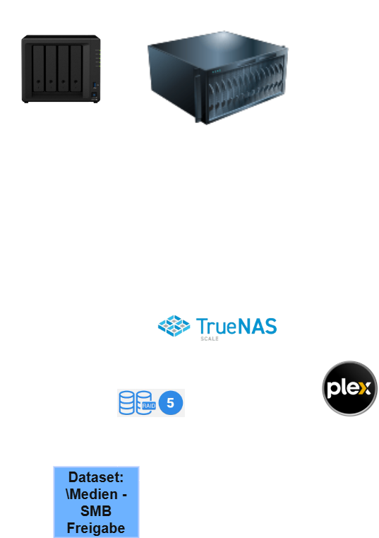

# Architektur

Dieses Diagramm zeigt den Aufbau des Plex-Setups:

## Details
- **Proxmox Server**: Hostet TrueNAS in einer VM und den LXC-Container für Docker.
- **TrueNAS**: Verwaltert das RAID 5 und bietet eine SMB-Freigabe für Plex.
- **Portainer/Docker**: Enthält den Plex-Container, der auf die SMB-Freigabe zugreift.

## Weitere Informationen
Zurück zur Hauptdokumentation: [README.md](../README.md)
